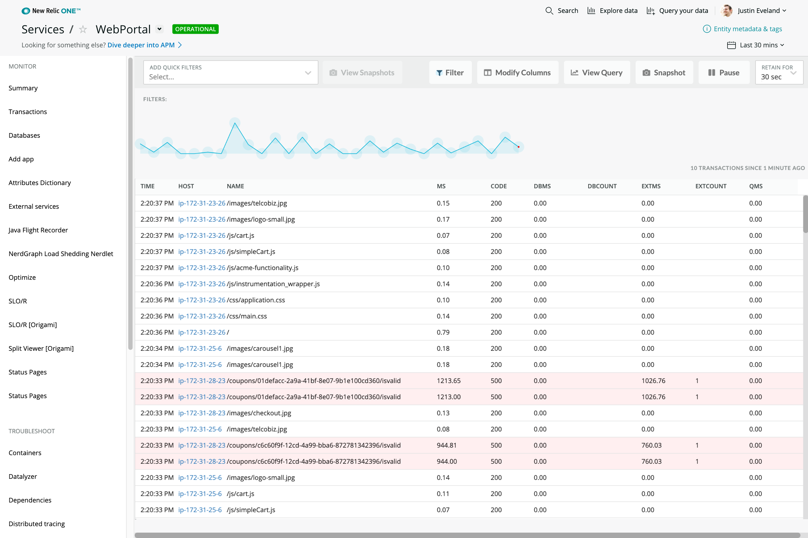

[](https://github.com/newrelic/open-source-office/blob/master/examples/categories/index.md#nr1-catalog)

# New Relic One Event Stream (nr1-event-stream)

  [](https://snyk.io/test/github/newrelic/nr1-event-stream)

## Usage

Event Stream is similar to Unix’s `tail` program, now focused on APM.

Event Stream uses data from `Transaction` and `TransactionError` events to display a live stream of processes occuring in your system.



> Note: this NerdPack is not served as a launcher on the homepage of [New Relic One](https://one.newrelic.com). Instead, you'll have to navigate through `Entity Explorer > Services > myServiceName > Troubleshoot > Event Stream`.

## Open Source License

This project is distributed under the [Apache 2 license](LICENSE).

## Dependencies

Requires [`New Relic APM`](https://newrelic.com/products/application-monitoring).

## Getting started

Clone this repository and run the following scripts:

```bash
nr1 nerdpack:clone -r https://github.com/newrelic/nr1-event-stream.git
cd nr1-event-stream
nr1 nerdpack:uuid -gf
npm install
npm start
```

Visit [https://one.newrelic.com/?nerdpacks=local](https://one.newrelic.com/?nerdpacks=local), navigate to the Nerdpack, and :sparkles:

## Deploying this Nerdpack

Open a command prompt in the nerdpack's directory and run the following commands.

```bash
# To create a new uuid for the nerdpack so that you can deploy it to your account:
nr1 nerdpack:uuid -g [--profile=your_profile_name]

# To see a list of APIkeys / profiles available in your development environment:
# nr1 profiles:list
nr1 nerdpack:publish [--profile=your_profile_name]
nr1 nerdpack:deploy [-c [DEV|BETA|STABLE]] [--profile=your_profile_name]
nr1 nerdpack:subscribe [-c [DEV|BETA|STABLE]] [--profile=your_profile_name]
```

Visit [https://one.newrelic.com](https://one.newrelic.com), navigate to the Nerdpack, and :sparkles:

## Community Support

New Relic hosts and moderates an online forum where you can interact with New Relic employees as well as other customers to get help and share best practices. Like all New Relic open source community projects, there's a related topic in the New Relic Explorers Hub. You can find this project's topic/threads here:

[https://discuss.newrelic.com/t/event-stream-nerdpack/83285](https://discuss.newrelic.com/t/event-stream-nerdpack/83285)

Please do not report issues with Event Stream to New Relic Global Technical Support. Instead, visit the [`Explorers Hub`](https://discuss.newrelic.com/c/build-on-new-relic) for troubleshooting and best-practices.

## Issues / Enhancement Requests

Issues and enhancement requests can be submitted in the [Issues tab of this repository](https://github.com/newrelic/nr1-event-stream/issues). Please search for and review the existing open issues before submitting a new issue.

## Contributing

Contributions are welcome (and if you submit a Enhancement Request, expect to be invited to contribute it yourself :grin:). Please review our [Contributors Guide](CONTRIBUTING.md).

Keep in mind that when you submit your pull request, you'll need to sign the CLA via the click-through using CLA-Assistant. If you'd like to execute our corporate CLA, or if you have any questions, please drop us an email at opensource@newrelic.com.
